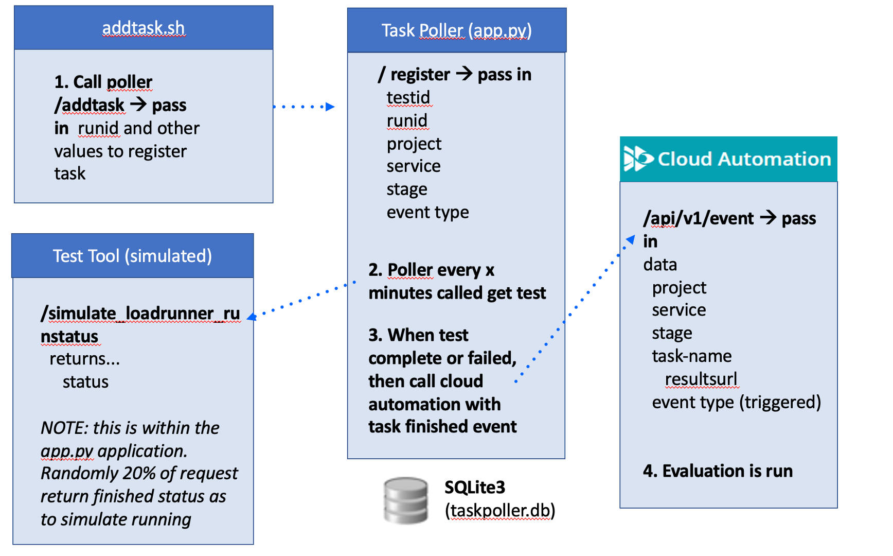

# Overview

Proof of concept task poller for the use case of longer running tasks, like a multi-hour load test, that need asynchronous processing between automation workflows.

This is one option to not have a pipeline tool or Cloud Automation sequence wait for several hours for the a test to complete.  And this is a workaround to tools that don't have a way to return status automatically to external tools such as an outbound webhook.

# Usage

## Setup

1. install python3 and pip
1. clone this repo and change into root folder
1. install packages `pip install -r requirements.txt`
1. create sqlite3 `taskpoller.db` database file by calling this script. `python create-db.py`
1. copy `secrets.template` to `secrets.json` 
    * update `KEPTN_BASE_URL` and `KEPTN_API_TOKEN`
    * you can leave `LOADRUNNER_BASEURL` and `LOADRUNNER_API_TOKEN` as is.

## Start App

1. start app `python app.py`.  This provides the URL to open in a browser
1. open the app in a browser.  For example `http://192.168.200.5:5000/`
1. in separate terminal run `./poller.sh`.  This calls the task process API every x seconds

## Task Processing (Simulation)

1. review `addtask.sh` and adjust the `project`, `service`, `stage`, and `type` values to match a project in your environment 
1. run `./addtask.sh 1 1` to simulate a new test
1. review browser to see task. Optionally, monitor database to review records.
1. review the logs in the broswer app
1. once the task is complete, review that the Cloud Automation sequence started

# Helpful tools and Reference

* [sqlitebrowser](https://sqlitebrowser.org) is a helpful tool to view and edit data.  On Mac install via `brew install --cask db-browser-for-sqlite` and open from the `Applications` option in finder.
* LoadRunner API
    * [Start A Test](https://admhelp.microfocus.com/lre/en/all/api_refs/Performance_Center_REST_API/Content/start_test_run.htm)
    * [Get Run Status](https://admhelp.microfocus.com/lre/en/all/api_refs/Performance_Center_REST_API/Content/Get_Run_Status.htm)

# To Do

1. Adjust `secrets.json` 
1. Adjust `process_loadrunner_task` method to call LoadRunner API as required
1. Adjust table and scripts to capture test start/stop time for SLO evaluation in table
1. Create a pipeline job demo end to end.  Call LoadRunner and register task.

